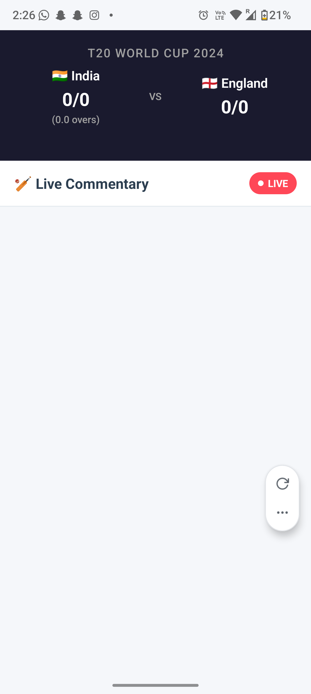
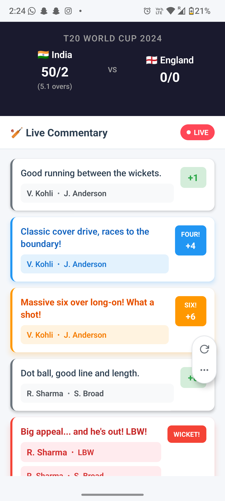
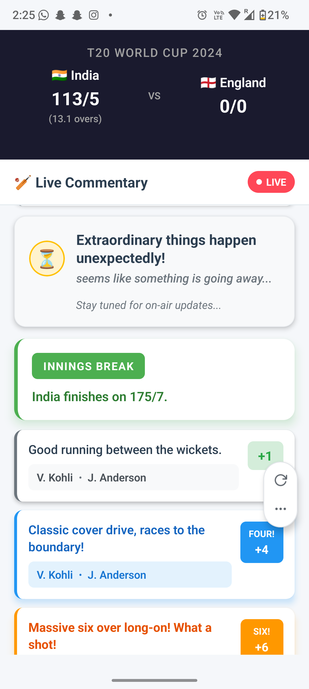

# Cricket Commentary App

React Native app for T20 cricket match commentary feed.

### App Preview

<table>
  <tr>
   <td align="center">
      
      <br/>
       <sub>Score and Event tracking page</sub>
    </td>
    <td align="center">
      
      <br/>
      <sub>Main commentary feed with live events</sub>
    </td>
    <td align="center">
      
      <br/>
   <sub>Unknown event handling and UI</sub>
    </td>
   
  </tr>
</table>

## What it does

- Shows live cricket commentary events
- Tracks scores automatically
- Handles different event types (balls, boundaries, wickets, etc.)
- Has a clean UI with smooth scrolling
- Uses Redux for state management
- Built with TypeScript

## Event Types

- BALL: Regular ball events
- BOUNDARY: Four runs
- SIX: Six runs
- WICKET: Wicket events
- MATCH_STATUS: Match updates
- OVER_COMPLETE: End of over
- UNKNOWN: Handles unexpected events

## Tech Stack

- React Native with Expo
- TypeScript
- Redux Toolkit
- Safe Area Context

## Project Structure

```
src/
├── components/
│   ├── CommentaryFeed.tsx
│   ├── MatchHeader.tsx
│   ├── CommentaryHeader.tsx
│   └── EventComponents/
│       ├── BallEvent.tsx
│       ├── BoundaryEvent.tsx
│       ├── SixEvent.tsx
│       ├── WicketEvent.tsx
│       ├── MatchStatusEvent.tsx
│       ├── OverCompleteEvent.tsx
│       └── UnknownEvent.tsx
├── store/
│   ├── index.ts
│   ├── slices/
│   │   ├── commentarySlice.ts
│   │   └── scoreSlice.ts
│   └── middleware/
│       └── dataStreamMiddleware.ts
├── types/
│   └── CricketEvent.ts
└── hooks/
    └── redux.ts
```

## Setup

1. Install dependencies:

   ```bash
   npm install
   ```

2. Start the app:

   ```bash
   npx expo start
   ```

3. Run on device:
   ```bash
   npx expo start --android
   npx expo start --ios
   ```

## How it works

- App starts streaming cricket events automatically
- Shows different event types with proper styling
- Calculates scores from events
- Handles unknown events with a funny message
- Restarts the commentary cycle when done

## Features

- Real-time event simulation (1.5s intervals)
- Score tracking and aggregation
- Error handling for unknown events
- Clean UI with smooth scrolling
- Redux state management
